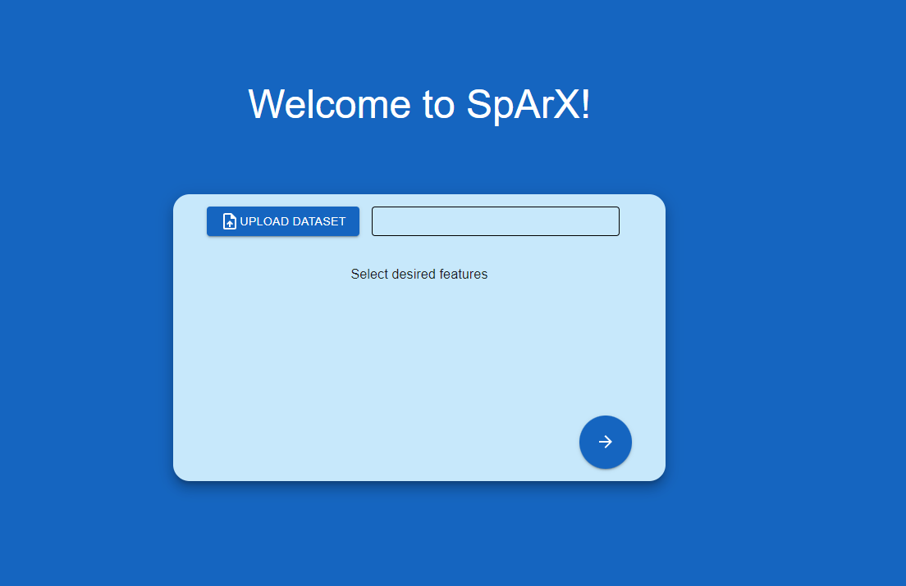
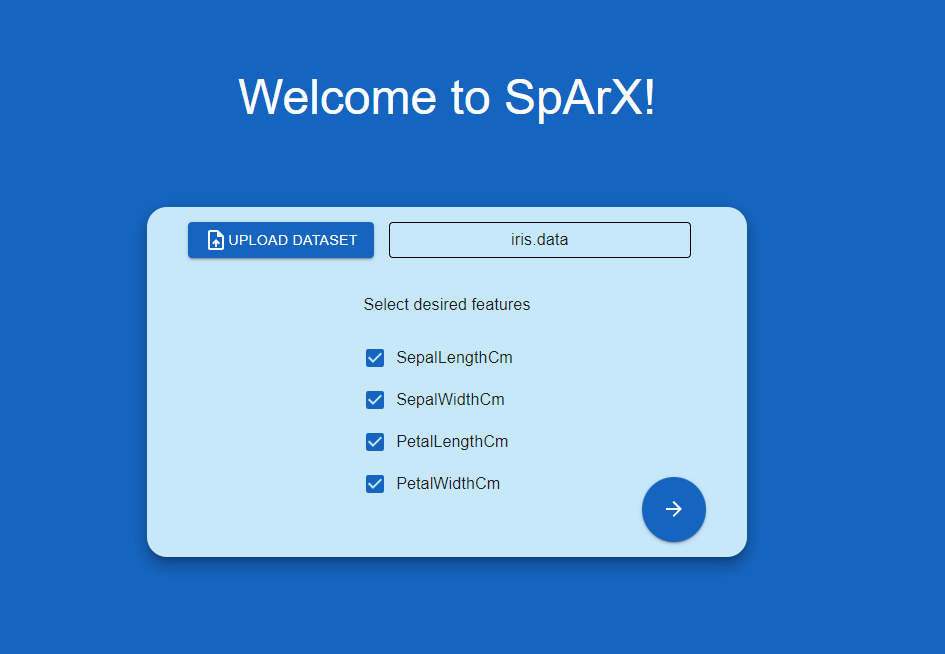
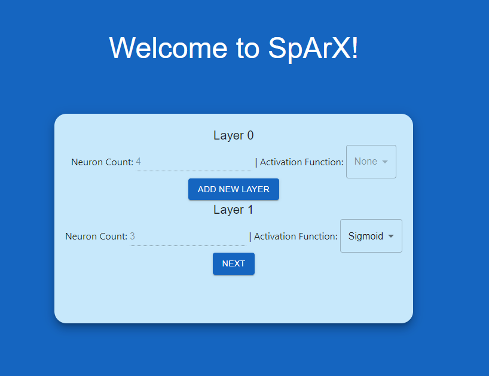
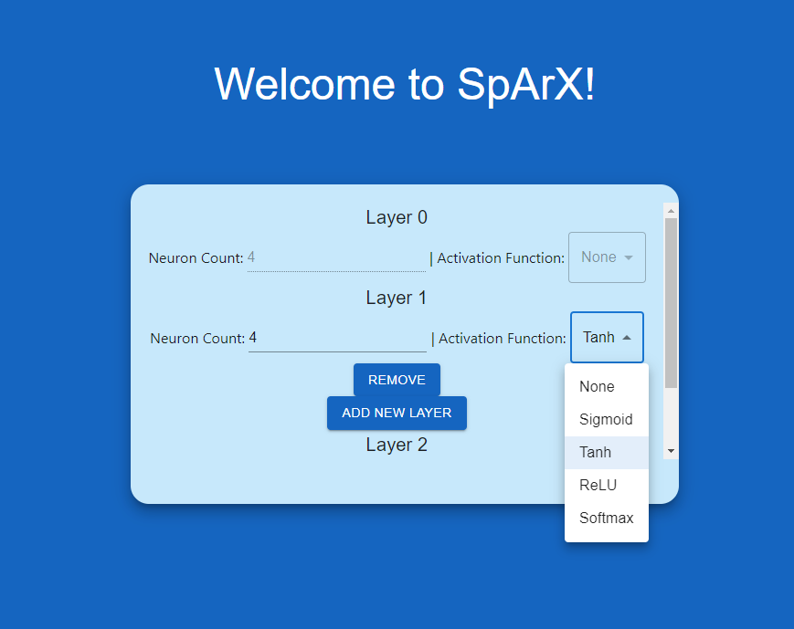
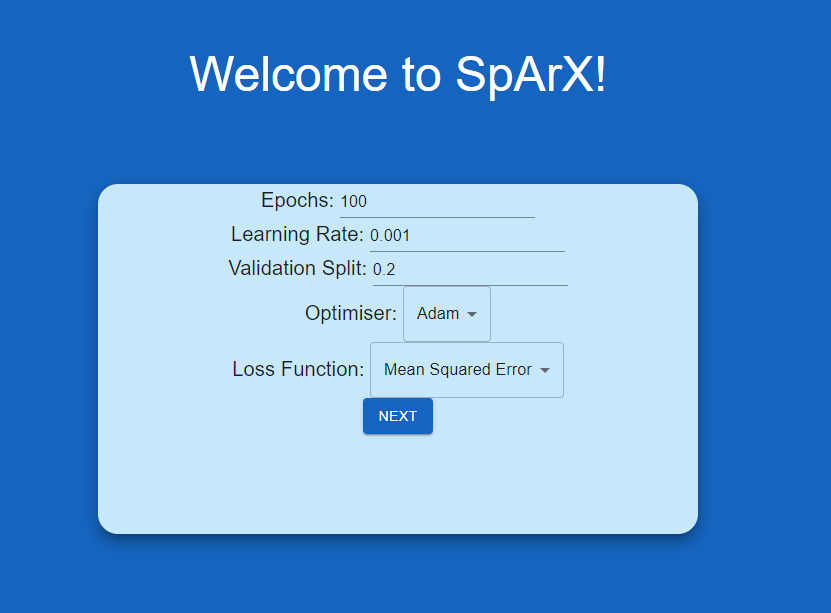
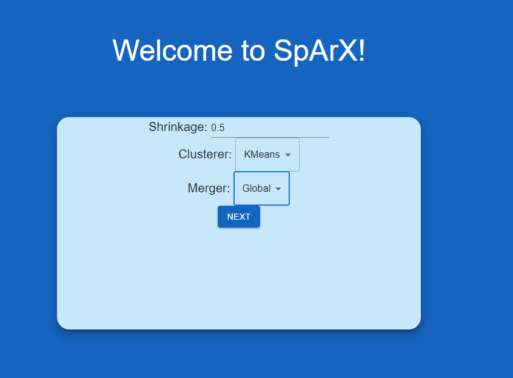
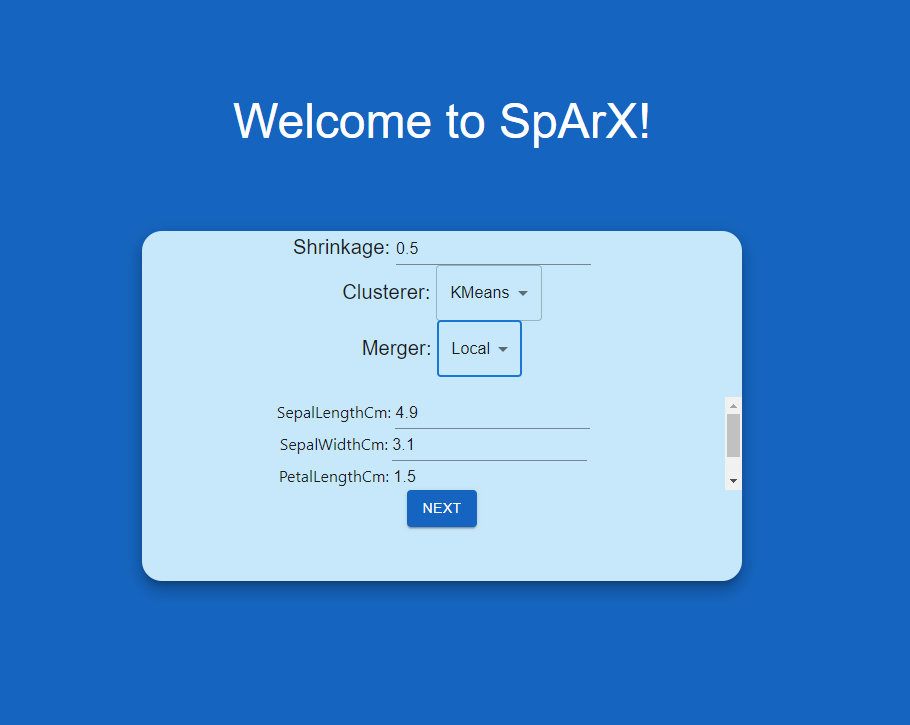
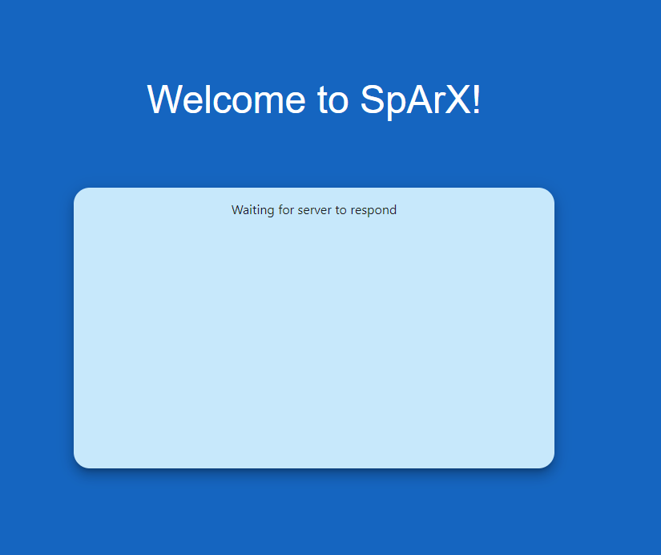

# SpArX-GUI
GUI for SpArX Neural Networks

Local-host:
===========
1. Clone repo from: [https://github.com/SpArX-Group-10/SpArX-GUI](https://github.com/SpArX-Group-10/SpArX-GUI)
    ```bash
    git clone https://github.com/SpArX-Group-10/SpArX-GUI
    ```

2.  Install requirements:
    
    ```bash
    pip install -r requirements.txt
    ```

3.  Give permission to the start script:
    ```bash
    chmod +x ./start.sh
    ```

4. To run the GUI, run the following bash script:
   ```bash
   ./start.sh
   ```

GUI: Model setup:
===========

### Upload dataset:


*Upload Dataset*

For example, using the Iris dataset:


*Uploaded Iris dataset*

Click on the ticks to choose which features of the dataset you would like to include.

### Neural network structure:


*Neural network structure options*

To add more layers, click on “Add new layer”.


*Neural network activation function options*

You can decide the number of neurons in each layer and select the activation function for each layer.

If you change your mind, you can remove a layer by clicking on “Remove”.

### More hyperparameter options:

Along with choosing the neural network structure, you can decide on other hyperparameters.


*Hyperparameter options*

Note: The number of epochs must be an integer (it will not let you put a non-integer value)

### Clustering options:
#### Global merging

*Global merging*
#### Local merging

*Local merging*

### Model setup is done!

Depending on the size of your dataset, neural network, number of epochs… etc it might take a long time to get your visualisation.


*Model setup waiting for server*
